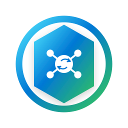

# UpdateWatch2 Server

Central management and distribution component of UpdateWatch2 — a system for centrally distributing, monitoring, and remotely triggering software/OS updates on managed endpoints.

- Runs in a Docker container.
- Persists all state in a SQLite database.
- Authenticates agents via mutual certificates; new agents require manual (or bulk) admin approval before receiving a client certificate.
- Exposes an HTTPS API that agents use to report alive-status, updates found, and reboot-required state, and through which the admin can remote-trigger update installs.
- Local `admin` account login (cookie session, brute-force protection) is implemented; AD-authenticated login is not yet.
- Administration area covers Active Directory integration, logging, email notifications, and user-customizable language (DE/EN) and theme (light/dark).
- `web/` holds the admin UI (TypeScript + React SPA).

See the project CLAUDE.md for the full architectural briefing, module layout, and configurable-behavior contract, and this repo's own open issues for what's still outstanding.

Companion repository: `updatewatch2-agent`.
