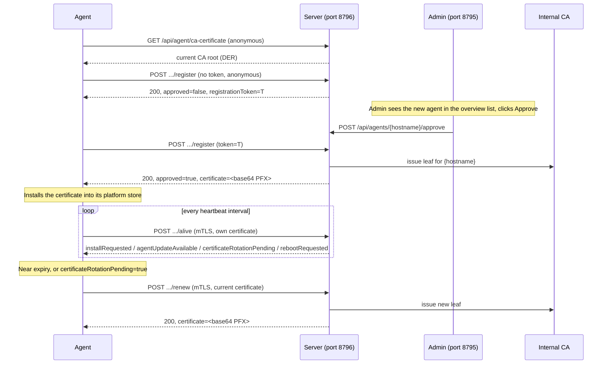

# Server architecture

High-level view of how `updatewatch2-server`'s own subsystems fit
together, and how they talk to an agent. See the root `CLAUDE.md` for the
authoritative, exhaustively detailed repository layout and history — this
document is a map to orient from, not a replacement for it.

## Component overview

```mermaid
flowchart TB
    subgraph "Admin-facing (cookie session, port 8795)"
        AdminUI["web/ (React SPA)"]
        AuthC["Auth/ — local admin + Active Directory"]
        AdminSettings["Admin/IAdminSettingsStore — live, DB-backed config"]
        AgentsSvc["Agents/AgentService — list/detail/approve/delete"]
        UpdatesSvc["Updates/IUpdateService — reported updates, install trigger"]
        UpdateFilters["UpdateFilters/ — regex exclusions"]
        CertAuthority["Certificates/ICertificateAuthority — internal CA"]
        AuditLog["Audit/IAuditLogService"]
    end

    subgraph "Agent-facing (mutual TLS, port 8796)"
        AgentProto["Api/Controllers/AgentProtocolController"]
        UpdatesCtl["Api/Controllers/UpdatesController"]
        RegSvc["Agents/AgentRegistrationService — register/alive/renew"]
    end

    subgraph "Background BackgroundServices"
        UpdWorker["AgentUpdates/AgentUpdateCheckWorker"]
        RetWorker["Audit/AuditLogRetentionWorker"]
        ExpWorker["Certificates/CertificateExpiryWorker"]
        VacWorker["Db/DatabaseVacuumWorker"]
        ThreshWorker["Notifications/UpdateThresholdNotificationWorker"]
        OfflineWorker["Notifications/AgentOfflineNotificationWorker"]
    end

    DB[("Db/AppDbContext — SQLite")]

    AdminUI -->|"PUT/GET /api/admin/..."| AdminSettings
    AdminUI --> AgentsSvc
    AdminUI --> UpdatesSvc
    AdminUI --> UpdateFilters
    AdminUI --> CertAuthority
    AdminUI --> AuditLog

    AgentProto --> RegSvc
    AgentProto --> CertAuthority
    UpdatesCtl --> UpdatesSvc
    RegSvc --> CertAuthority

    AgentsSvc --> DB
    UpdatesSvc --> DB
    RegSvc --> DB
    AdminSettings --> DB
    AuditLog --> DB

    UpdWorker --> DB
    RetWorker --> DB
    ExpWorker --> CertAuthority
    VacWorker --> DB
    ThreshWorker --> AdminSettings
    OfflineWorker --> AdminSettings

    Agent(("An agent, over mTLS")) -->|register / alive / renew| AgentProto
    Agent -->|report updates / install-ack / reboot-ack| UpdatesCtl
    Agent -->|GET ca-certificate(s), GET updates/{fileName}| AgentProto
```

Two Kestrel listeners, configured explicitly in `Program.cs` — never via
`ASPNETCORE_URLS`:

- **Port 8795** (admin UI + its API): plain HTTP, meant to sit behind a
  TLS-terminating reverse proxy. Auth is a cookie
  (`UpdateWatch2.Auth`), issued by the local `admin` account or Active
  Directory (LDAP bind + group-membership check).
- **Port 8796** (agent-facing): Kestrel terminates TLS directly, no proxy
  in front, `ClientCertificateMode.AllowCertificate` (not `Require` — an
  agent's very first `register` call has no certificate at all).

## Certificate lifecycle

The mutual-TLS backbone (CLAUDE.md's "Certificate-based mutual auth is the
security backbone") in one diagram:



Two further paths worth knowing, both covered in depth in the root
`CLAUDE.md`:

- **Admin-mediated re-issuance**: if an agent's certificate is genuinely
  lost (wiped disk, corrupted store), an admin generates a fresh
  registration token from the agent's detail page; the agent's
  `RegistrationWorker` (a persistent maintenance loop, not a run-once
  task) picks it up on its next poll with no service restart needed.
- **CA root rotation**: `PrepareRotation` → (agents pick up the new root
  additively via `GET /api/agent/ca-certificates`) → `ActivateRotation`
  (re-issues the server's own leaf immediately, no restart) →
  `RetirePreviousRoot`. `certificateRotationPending` on the `alive`
  response is what closes the gap this would otherwise leave — an
  already-onboarded agent's own leaf doesn't move with the root
  automatically, so this field prompts an eager renewal instead of
  waiting out that agent's own expiry-driven schedule.

## Background workers

Every server-side `BackgroundService`, in the order each was added (see
`CLAUDE.md` for the full history and every live-verified bug each one
surfaced):

1. **`AgentUpdates/AgentUpdateCheckWorker`** — polls GitHub (or accepts a
   manual upload) for a newer agent release, downloads/verifies its
   assets, and computes the per-agent offer `alive` surfaces.
2. **`Audit/AuditLogRetentionWorker`** — purges audit log entries older
   than the admin-configured retention window.
3. **`Certificates/CertificateExpiryWorker`** — warns about (and, for the
   server's own leaf, proactively renews) an approaching CA-root/server-
   leaf expiry.
4. **`Db/DatabaseVacuumWorker`** — reclaims freed SQLite pages
   (`PRAGMA incremental_vacuum` + a WAL checkpoint) on a fixed 24h
   cadence.
5. **`Notifications/UpdateThresholdNotificationWorker`** — the
   updates-per-machine / affected-machines email notification.
6. **`Notifications/AgentOfflineNotificationWorker`** — the
   went-offline / back-online email notification, edge-triggered per
   agent against the admin-configured offline threshold.

All six follow the same shape: a check immediately on startup, then every
fixed or admin-configured interval, re-reading live settings from
`IAdminSettingsStore` on every tick rather than capturing them once.

## Data flow: how "pending updates" actually gets to the screen

1. An agent's own `UpdateCheckWorker` (agent repo) detects pending OS
   updates and calls `POST /api/agents/{hostname}/updates`.
2. `UpdateService.ReportUpdatesAsync` merges the report against what's
   already stored (matched by `PackageId`, falling back to `Title`) —
   never a wholesale replace, so `DetectedAt` and `UpdateItem.Id` stay
   stable across reports (the latter is what a selective-install
   selection in the admin UI is pinned to).
3. `AgentService`/`AgentsListPage` compute the *displayed* pending count
   live against the current `UpdateFilters/` regex exclusions — the raw,
   unfiltered count is what's actually stored on `Agent.PendingUpdateCount`.
4. `Notifications/UpdateThresholdNotificationWorker` evaluates the same
   filtered view against the admin-configured thresholds on its own
   cadence and fires an edge-triggered email if either threshold is
   newly crossed.

The `AgentOfflineNotificationWorker`/offline-icon story follows the
identical "never trust a periodically-updated stored flag for display,
compute live" principle — see `Agents/AgentOfflineOptions`'s own doc
comment.

## Where to look next

- `../CLAUDE.md` — the authoritative, continuously-updated project brief;
  every subsystem's own doc comments link back to the specific issue or
  user request that shaped it.
- `protocol.md` — the wire shapes this diagram's arrows actually carry.
- `deployment.md` — how to actually stand this up.
